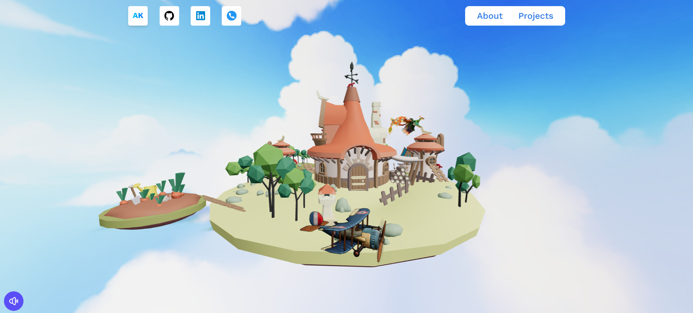
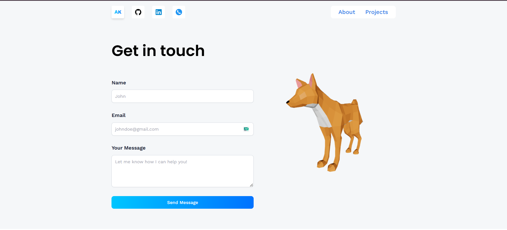

# 3D Portfolio

A personal 3D portfolio built with React, Vite, Tailwind CSS and React Three Fiber. This project demonstrates loading GLB models, basic scene setup with lighting and interaction, and a contact form using EmailJS.

Live demo: https://3-d-portfolio-three-gamma.vercel.app/

## Screenshots 📸





## Project version / key dependencies

This README reflects the versions used in this project (see `package.json`):

- Node / npm: use a recent Node 18+ runtime
- React: ^18.2.0
- Vite: ^7.1.7
- Tailwind CSS: ^3.4.18
- @react-three/fiber: ^8.18.0
- @react-three/drei: ^9.122.0
- @emailjs/browser: ^4.4.1 (client) and @emailjs/nodejs ^5.0.2 (server functions)
- gh-pages: ^6.3.0 (optional, for GitHub Pages deploy)

Check `package.json` for the full dependency list.

## Quick Start (development)

1. Install dependencies

```bash
npm install
```

2. Run the dev server

```bash
npm run dev
```

Open http://localhost:5173 (or the port Vite reports).

## Environment variables

The project uses Vite environment variables (exposed to the client must start with `VITE_`). Add a `.env` file in the project root:

```
VITE_APP_EMAILJS_SERVICE_ID=service_id
VITE_APP_EMAILJS_TEMPLATE_ID=template_id
VITE_APP_EMAILJS_PUBLIC_KEY=public_key
```

- For local dev, place them in `.env` as above.
- For production (e.g. Vercel), set them in the deployment environment settings.


## Project structure (key files)

- `src/` – React source
	- `pages/` – top-level pages (Home, Contact, etc.)
	- `models/` – GLB model loaders and three.js components
	- `components/` – shared components (Loader, etc.)
- `public/` – static assets and screenshots
- `vite.config.js` – Vite configuration (base, asset handling)

## License

- This project is free to use and modify as you like. 
- __Made with ❤️ by [Akshansh]__.

